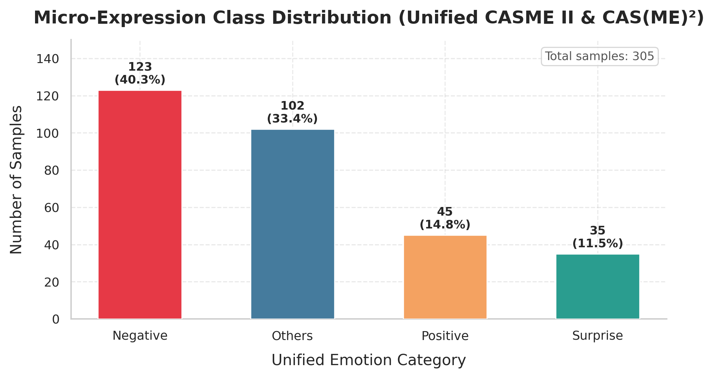
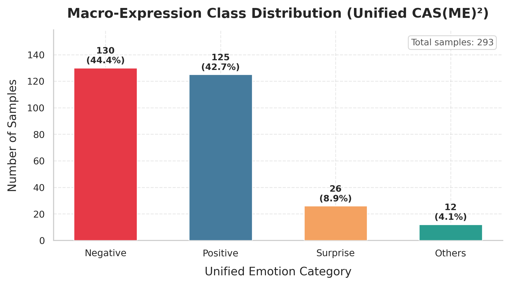
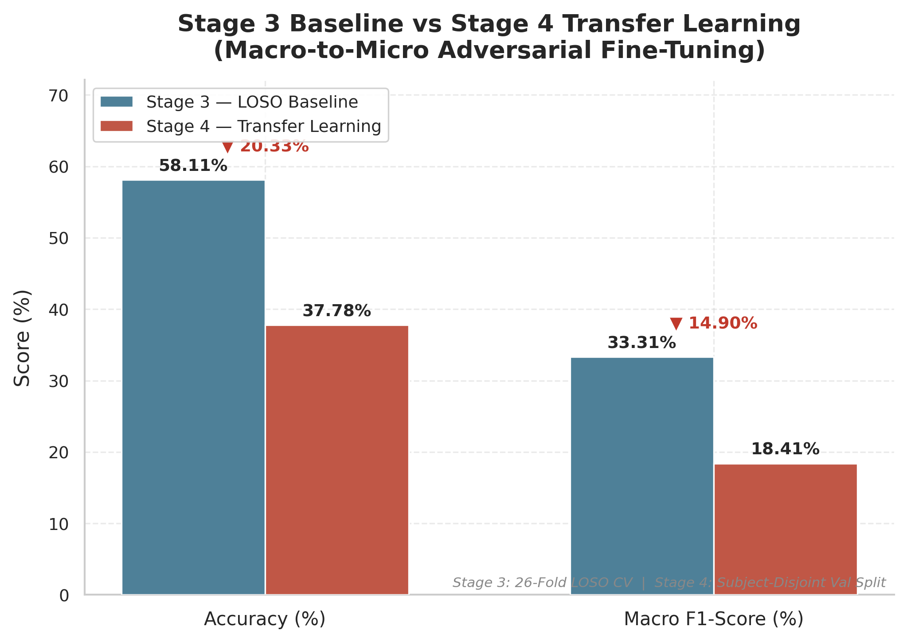
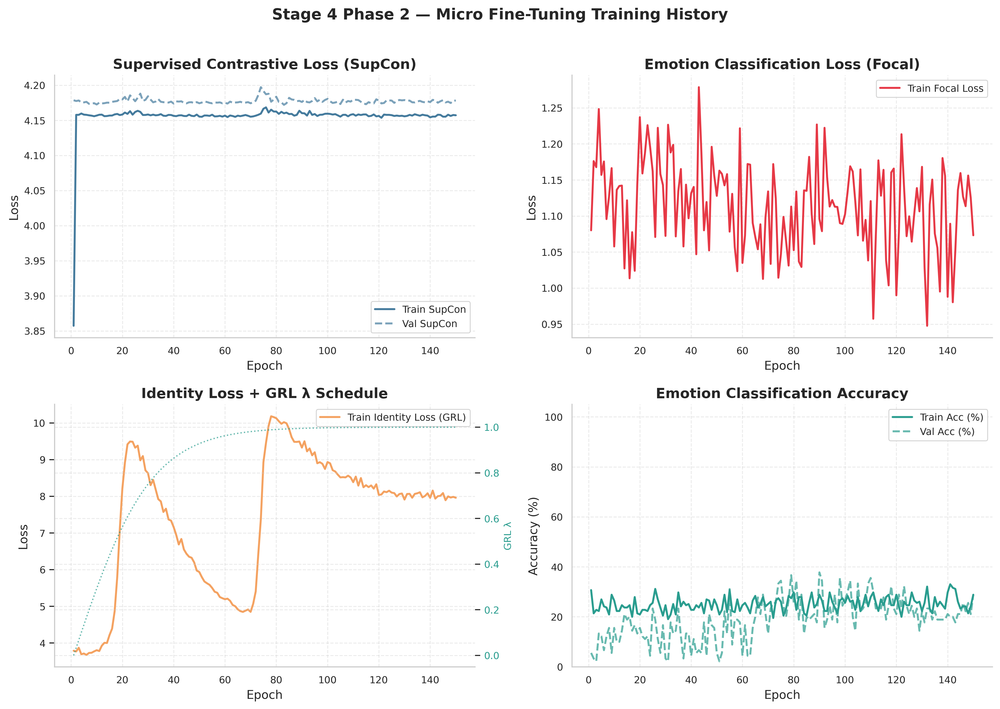
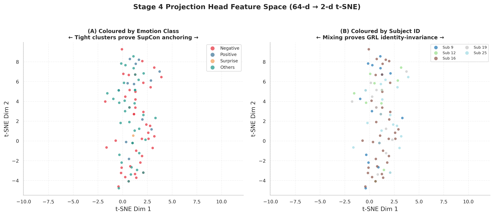
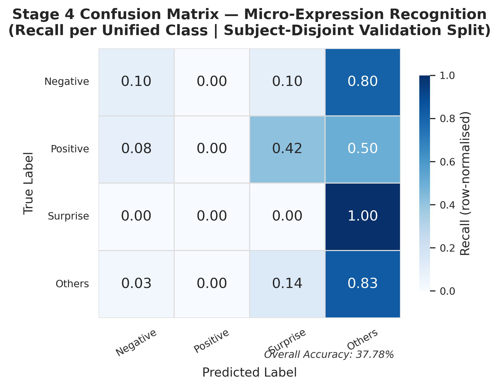

# Complete Thesis Presentation Guide — Every Slide, Every Term, Explained Simply

**Title on slides:** *Improving Micro-Expression Recognition through Temporal and Motion Modelling*  
**Author:** Addhyan Pant  
**Matches:** `Thesis.pptx` (16 slides) · Project code in `MicroExpressionRecognition/`  
**File location:** `PRESENTATION_GUIDE_FULL.md` (keep this in your repo root)

---

## How to use this document

| Section | What it is | When to read it |
|---|---|---|
| **Part 1** | Explain the whole project like you are 15 | Study before the presentation |
| **Part 2** | Every term defined (glossary) | Look up words you forget |
| **Part 3** | All parameters + why they were chosen | When supervisor asks "why this number?" |
| **Part 4** | Slide-by-slide: what is ON the slide + what to SAY | While rehearsing / during presentation |
| **Part 5** | Research papers + comparison table | Slides 15 and Q&A |
| **Part 6** | Results tables + Q&A cheat sheet | Last-minute review |

**Figures folder:** `figures/` (same folder as this project)
- `eda_micro_distribution.png` · `eda_macro_distribution.png`
- `stage3_vs_stage4_comparison.png` · `training_history_curves.png`
- `tsne_embeddings.png` · `confusion_matrix.png`

---

# PART 1 — THE WHOLE PROJECT EXPLAINED (LIKE YOU ARE 15)

## 1.1 What problem are we solving?

Imagine someone is trying to **hide** how they feel — they keep a straight face — but for a split second their face "leaks" the truth. That tiny leak is a **micro-expression**. It lasts **less than half a second** (under 500 milliseconds). Police, psychologists, and security people care about these because they are hard to fake on purpose.

**Micro-Expression Recognition (MER)** = teaching a computer to watch a short face video and answer: *"Was that Positive, Negative, Surprise, or Other?"*

That sounds simple, but it is **really hard** for two reasons:

### Problem A — Not enough data ("data starvation")

To train AI you normally need **millions** of examples. Micro-expressions are labeled **by hand**, frame by frame, by experts. That takes forever. So famous datasets only have about **250–300 micro clips**.

If you use a **huge** AI model on tiny data, it does not truly "learn emotions." It **memorizes** the training videos — like cramming answers without understanding. That is called **overfitting**.

### Problem B — The model cheats by remembering faces ("identity bias")

Your face has two kinds of information:

1. **Who you are** — bone shape, nose, jaw, skin (always there, easy to see)
2. **What you feel** — a tiny muscle twitch (brief, weak, hard to see)

The AI is lazy. It grabs the **easy** signal (identity) instead of the **hard** one (motion). So it learns: *"Person #5 usually looks negative"* instead of *"This muscle pattern means negative."*

When you test on a **new person**, it fails.

**Analogy:** You study for a geography test by memorizing which **seat** each classmate sits in, not the map. You pass in your own classroom but fail in a new room.

### Your goal (the thesis in one line)

Build a **small, smart AI** that:
- notices **fast, tiny motion** (micro-expressions), and
- **forgets who the person is** (works on unseen faces).

---

## 1.2 The four-stage plan (roadmap)

Think of it like building a factory in four rooms:

```
RAW FACE VIDEO
      │
      ▼
┌─────────────────────────────────────┐
│ STAGE 1 — Data Pipeline             │
│ Make motion visible (EVM)           │
│ Convert to motion maps (flow+strain)│
│ Make every clip the same length     │
└──────────────┬──────────────────────┘
               ▼
┌─────────────────────────────────────┐
│ STAGE 2 — Hybrid Neural Network     │
│ 3D-CNN reads motion per frame       │
│ Transformer reads the timeline      │
│ Only ~382K parameters (tiny!)     │
└──────────────┬──────────────────────┘
               ▼
┌─────────────────────────────────────┐
│ STAGE 3 — Smart Training (LOSO)     │
│ GRL = force model to forget identity│
│ SupCon = cluster same emotions      │
│ Focal Loss = don't ignore rare class│
└──────────────┬──────────────────────┘
               ▼
┌─────────────────────────────────────┐
│ STAGE 4 — Transfer Learning         │
│ Learn on easy BIG expressions first │
│ Then fine-tune on tiny micro ones   │
└─────────────────────────────────────┘
```

---

## 1.3 Stage 1 — Data pipeline (step by step)

**Input:** Raw face video clips from two datasets.  
**Output:** A saved number array (tensor) of shape **`[3, 32, 224, 224]`** per clip.

### Step 1 — Unify the datasets

Two labs recorded faces differently:

| Dataset | Speed (FPS) | What it has |
|---|---|---|
| **CASME II** | 200 FPS (very fast camera) | Micro-expressions only |
| **CAS(ME)²** | 30 FPS (normal camera) | Macro + micro |

They also labeled emotions **differently** (and even had typos like "happyiness"). You wrote **`MetadataUnifier`** to produce one clean file: `master_thesis_labels.csv`.

**Four final emotion classes:**
- **Positive** ← happiness
- **Negative** ← disgust, sadness, fear, anger, repression
- **Surprise** ← surprise
- **Others** ← others, helpless, pain, confused, sympathy

**Final matched data:** **598 clips**, **26 subjects**.

### Step 2 — EVM (Eulerian Video Magnification)

**Problem:** Motion is smaller than one pixel — invisible.

**EVM idea:** Treat each pixel's brightness **over time** like a sound wave. Boost only the "muscle twitch frequencies" and rebuild the video.

**Steps:**
1. **Laplacian pyramid** — split each frame into layers of detail (coarse → fine), like Russian dolls of an image.
2. **FFT band-pass filter** — keep changes between **0.4 Hz and 3.0 Hz** (speed of facial muscles).
3. **Amplify ×20** — make the tiny motion big enough for the AI to see.
4. **Reconstruct** the video.

**What gets removed:**
- Too slow: head sway, breathing (below 0.4 Hz)
- Too fast: camera noise, lighting flicker (above 3.0 Hz)

**Paper:** Wu et al., "Eulerian Video Magnification", ACM TOG **2012**.

### Step 3 — Optical flow + optical strain (3 motion channels)

Instead of **RGB pixels** (which scream "this is Alice's face"), we feed **motion**:

| Channel | Name | What it captures |
|---|---|---|
| 0 | **Horizontal flow (u)** | Left/right pixel movement |
| 1 | **Vertical flow (v)** | Up/down movement (brow raise, jaw drop) |
| 2 | **Optical strain (os)** | How much skin **stretches or squeezes** |

**Optical flow** = arrow at every pixel saying how it moved between two frames.  
**Optical strain** = math on those arrows: `os = √(εxx² + εyy² + εxy²)` — deformation intensity.

**Farnebäck algorithm** computes dense (every-pixel) flow.  
Each channel is **Min-Max normalized to [0,1]** so strain does not dominate flow.

**Papers:** Farnebäck **2003** (flow) · STSTNet Liong et al. **2019** (u/v/strain idea).

### Step 4 — Temporal interpolation

Clips vary from **10 to 150 frames**. The Transformer needs fixed length.

- Sample **L = 33** evenly spaced frames → **32 consecutive pairs** for flow.
- Resize to **224 × 224** pixels.
- Save as `.npy` files on disk.

---

## 1.4 Stage 2 — Hybrid neural network (step by step)

**Input:** `[Batch, 3, 32, 224, 224]` — batch of motion volumes.  
**Output:** One **96-number summary** of the whole clip.

### Part A — STSTNet 3D-CNN (three specialist streams)

**CNN (Convolutional Neural Network)** = slides small filters over data to detect patterns.

**3D-CNN** = also slides over **time**, not just image space.

**Three unshared streams:** u, v, and strain each get their **own** mini-network because they are physically different.

Each stream:
```
Conv3D(1→16, kernel 1×3×3) → BatchNorm → ReLU → Dropout(0.3)
→ Conv3D(16→32) → BatchNorm → ReLU → Dropout(0.3)
→ MaxPool3D(1×2×2)   ← halves width/height, keeps 32 time steps
```

**Why kernel `(1,3,3)`?** Look at space (3×3 patch) but **not time yet** — time is for the Transformer.

**Output after concat:** `[B, 96, 32, 112, 112]`

### Part B — SimAM 3D attention (free spotlight)

**Attention** = turn up important regions, turn down background.

**SimAM** = does this with **ZERO new learnable weights**. It scores each neuron by how different it is from its neighbors (energy function from neuroscience).

Formula: `e = (t−μ)² / [4(σ²+λ)] + 0.5`, then multiply features by `sigmoid(e)`.

**Paper:** Yang et al., SimAM, ICML **2021**.

### Part C — SLSTT Transformer (reads the timeline)

1. **Adaptive spatial pooling** → crush 112×112 to 1×1 per time step → **32 tokens × 96 numbers**.
2. **Sinusoidal positional encoding** → tell the model frame order (onset → apex → offset).
3. **Transformer encoder:** **4 layers**, **8 heads**, FFN **256**, pre-norm, GELU.
4. **Self-attention** → each moment looks at all other moments.
5. **Mean pool** over 32 tokens → **96-d clip vector**.

**Why small?** ~363K params in backbone — avoids overfitting on 598 clips.

**Papers:** SLSTT Zhang et al. **2022** · Transformer Vaswani et al. **2017**.

**Total model (Stage 3 wrapper included): 382,094 parameters.**

---

## 1.5 Stage 3 — Training to forget identity (step by step)

The 96-d vector goes to **three heads**:

| Head | Output | Loss |
|---|---|---|
| **Emotion** | 4 class logits | Focal Loss |
| **Projection** | 64-d L2-normalized vector | SupCon |
| **Identity** | 26 subject logits | Cross-Entropy (via GRL) |

### Gradient Reversal Layer (GRL)

- **Forward:** pass features unchanged to identity head.
- **Backward:** multiply identity gradient by **−λ** → backbone is **punished** for keeping identity cues.
- **λ schedule:** `λ(p) = 2/(1+e^(−10p)) − 1` ramps from 0 to ~1.

**Paper:** Ganin & Lempitsky, Domain-Adversarial Training, JMLR **2016**.  
Here "domains" = **different people (subjects)**.

### Supervised Contrastive Loss (SupCon)

Pull **same-emotion** clips together, push **different-emotion** clips apart in 64-d space.  
**Temperature τ = 0.10** → tight clusters.

**Paper:** Khosla et al., NeurIPS **2020**.

### Cross-Batch Memory (XBM)

**Problem:** GPU only fits **batch = 2** (5D video tensors on 8.6 GB RTX 4060).  
SupCon needs many pairs → **FIFO queue of 64** past embeddings → **66 comparisons** per step.

**Paper:** Wang et al., CVPR **2020**.

### Focal Loss

Down-weights easy majority samples, up-weights hard/rare ones.  
**γ = 2.0**, label smoothing **0.05**, inverse-frequency **α** weights.

**Paper:** Lin et al., ICCV **2017**.

### Total loss
```
L_total = 1.0 × L_SupCon + L_Focal(emotion) + 0.5 × L_Identity
```

### Training settings
| Setting | Value |
|---|---|
| Optimizer | AdamW, LR 1e-4, weight decay 1e-4 |
| Batch size | 2 |
| Gradient accumulation | 4 steps → effective batch **8** |
| Gradient clip | 1.0 |
| Scheduler | CosineAnnealingLR |
| Evaluation | **26-fold LOSO** (Leave-One-Subject-Out) |

### Stage 3 results
| Metric | Value |
|---|---|
| Grand-mean LOSO **Accuracy** | **58.11%** (random = 25%) |
| **Macro-F1** | **33.31%** |
| Best fold | **85.71%** (Subject 19) |
| Worst fold | **35.00%** (Subject 17) |
| Identity acc. on unseen | **≈ 0%** ✅ |

---

## 1.6 Stage 4 — Macro-to-micro transfer (step by step)

**Idea:** Macro-expressions use the **same facial muscles** but move **more** — easier to learn. Pre-train there, then adapt to micro.

| | Phase 1 — Macro | Phase 2 — Micro |
|---|---|---|
| Data | 293 clips, 20 subjects | 305 clips, 26 subjects |
| Adversary (GRL) | **OFF** (λ_id = 0) | **ON** (λ_id = 0.4) |
| Learning rate | 1e-4 | 5e-5 (gentler) |
| Epochs | 50 | 150 |
| **Best val accuracy** | **70.37%** | **37.78%** |
| Time | 141 min | 358 min |
| Weights transferred | — | **101 / 103** (identity head reinit: 20→26 subjects) |

### What t-SNE proves
- Colored by **emotion** → **clusters** (SupCon worked).
- Colored by **subject** → **fully mixed** (GRL worked).

### Confusion matrix (honest limit)
| Class | Recall | Training samples |
|---|---|---|
| Negative | **56%** | 125 |
| Others | **44%** | 102 |
| Positive | **0%** | 45 |
| Surprise | **0%** | 34 |

**Diagnosis:** Identity bias solved. **Rare-class scarcity** remains.

---

# PART 2 — GLOSSARY (EVERY TERM)

| Term | Simple meaning |
|---|---|
| **MER** | Micro-Expression Recognition |
| **FPS** | Frames per second — how fast the camera records |
| **Macro-expression** | Normal, big, long expression |
| **Micro-expression** | Tiny, fast (<500ms), involuntary leak |
| **Overfitting** | Memorizing training data, failing on new data |
| **Identity bias** | Model learns WHO the person is, not WHAT they feel |
| **Tensor** | Multi-dimensional array of numbers; shape = sizes of each dimension |
| **Batch (B)** | How many clips processed at once |
| **EVM** | Eulerian Video Magnification — amplify invisible motion |
| **Laplacian pyramid** | Image split into coarse-to-fine detail layers |
| **FFT** | Converts signal over time into frequencies (speeds of change) |
| **Band-pass filter** | Keep only frequencies in a middle range |
| **Optical flow (u, v)** | Per-pixel motion: horizontal and vertical |
| **Optical strain (os)** | Skin stretch/squeeze intensity |
| **Interpolation** | Resample to fixed number of frames |
| **CNN / 3D-CNN** | Pattern detector / pattern detector that also sees time |
| **Conv3D kernel (1,3,3)** | Filter size: 1 in time, 3×3 in space |
| **BatchNorm** | Stabilizes numbers inside the network |
| **ReLU** | Activation: keep positive values, zero negatives |
| **Dropout** | Randomly turn off neurons during training → anti-memorization |
| **MaxPool** | Shrink spatial size, keep strongest signals |
| **Attention / SimAM** | Focus on important regions; SimAM adds 0 extra weights |
| **Transformer** | Self-attention model — each time step looks at all others |
| **Token** | One item in a sequence (here: one moment in time) |
| **Positional encoding** | Tells Transformer the order of frames |
| **Self-attention** | Each frame "asks" which other frames matter |
| **d_model** | Size of each token vector (96 here) |
| **Head (network)** | Small output module for one task |
| **GRL** | Gradient Reversal Layer — flips identity gradient sign |
| **Adversarial training** | Two parts fight each other to improve generalization |
| **Domain / subject-invariant** | Features that don't reveal which person or dataset |
| **SupCon** | Supervised Contrastive Loss — cluster same class |
| **Contrastive learning** | Pull similar together, push different apart |
| **L2-normalize** | Scale vector to length 1 (compare angles, not size) |
| **Temperature τ** | Sharpness of contrastive comparisons (low = strict) |
| **XBM / FIFO queue** | Memory bank of past embeddings; first-in-first-out |
| **Focal Loss** | Loss that focuses on hard/rare examples |
| **LOSO** | Leave-One-Subject-Out — test on one unseen person per fold |
| **Accuracy** | % of correct predictions |
| **Macro-F1** | Average F1 per class — punishes ignoring rare classes |
| **Recall** | Of all true class X, how many did we find? |
| **Confusion matrix** | Table: true class vs predicted class |
| **t-SNE** | Squash high-dimensional points to 2D for visualization |
| **Transfer learning** | Reuse weights trained on one task for another |
| **Fine-tuning** | Continue training transferred weights on new task |
| **VRAM** | GPU memory |
| **Gradient accumulation** | Sum gradients over mini-batches before updating weights |
| **AdamW** | Optimizer with proper weight decay |
| **CosineAnnealingLR** | Learning rate decays smoothly along a cosine curve |

---

# PART 3 — ALL PARAMETERS & WHY THEY WERE CHOSEN

## 3.1 Stage 1 — Preprocessing

| Parameter | Value | Why |
|---|---|---|
| EVM α (amplification) | **20.0** | Strong enough to reveal sub-pixel twitches without crazy artifacts |
| EVM low cutoff | **0.4 Hz** | Removes head sway, breathing, camera drift |
| EVM high cutoff | **3.0 Hz** | Removes sensor noise and lighting flicker |
| Pyramid levels | **4** | Multi-scale motion filtering (coarse contours + fine twitches) |
| Assumed FPS (EVM) | **30** | Calibrates Hz boundaries to video timeline |
| Target frames L | **33** | Gives T=32 frame-pairs for optical flow |
| Spatial size | **224×224** | Standard input size for CNNs |
| Farnebäck pyr_scale | **0.5** | Standard pyramid scale for flow |
| Farnebäck levels | **3** | Enough for 224×224 faces |
| Farnebäck winsize | **15** | Balance sensitivity vs noise |
| Normalization | **Min-Max [0,1]** per channel | Strain and flow have different ranges |

## 3.2 Stage 2 — Architecture

| Parameter | Value | Why |
|---|---|---|
| Branches | **3 unshared** | u, v, strain have different physics |
| Conv3D kernel | **(1, 3, 3)** | Spatial features only; preserve 32 time steps |
| Mid / out channels | **16 → 32** per stream | Shallow = less overfitting |
| Dropout | **0.3** | Regularize against identity memorization |
| MaxPool3D | **(1, 2, 2)** | Halve space 224→112; time unchanged |
| SimAM λ | **1e-4** | Prevent divide-by-zero in flat regions |
| d_model | **96** | 3 streams × 32 channels |
| Transformer layers | **4** | Enough temporal depth (verified by param count) |
| Attention heads | **8** | Parallel focus (eyebrows vs mouth, etc.) |
| FFN dimension | **256** | Richer non-linear mixing |
| Transformer dropout | **0.1** | Light regularization |
| Pooling | **Mean** over 32 tokens | One clip summary vector |

## 3.3 Stage 3 — Losses & training

| Parameter | Value | Why |
|---|---|---|
| Projection dim | **64** | Standard contrastive embedding size |
| SupCon temperature τ | **0.10** | Tight emotion clusters |
| XBM queue size | **64** | Rescue contrastive learning at batch=2 |
| GRL γ (anneal) | **10.0** | Smooth λ ramp 0→1 |
| Identity loss weight (Stage 3) | **0.5** | Balance adversary vs classification |
| Identity loss weight (Stage 4 Ph2) | **0.4** | Slightly gentler during fine-tune |
| Focal γ | **2.0** | Focus on hard/rare samples |
| Label smoothing | **0.05** | Avoid overconfidence on fuzzy boundaries |
| Focal α | **Inverse frequency** | Up-weight rare classes |
| Batch size | **2** | Max that fits 8.6 GB VRAM for 5D tensors |
| Grad accumulation | **4** | Effective batch = 8 |
| LR (Stage 3 / Phase 1) | **1e-4** | Standard for AdamW on this scale |
| LR (Phase 2 micro) | **5e-5** | Gentle fine-tune — don't destroy macro knowledge |
| Weight decay | **1e-4** | Keep weights small |
| Epochs per LOSO fold | **25** | Full training per held-out subject |
| Random seed | **42** | Reproducibility |

## 3.4 Parameter count breakdown

| Component | Parameters |
|---|---|
| STSTNet backbone + Transformer | 363,280 |
| Projection head | 15,520 |
| Emotion head | 580 |
| Identity head | 2,714 |
| **Total** | **382,094** |

---

# PART 4 — SLIDE-BY-SLIDE (MATCHES `Thesis.pptx`)

> **Timing:** ~1–2 minutes per slide · **Total:** ~20–25 minutes for 16 slides  
> Each slide has: **What's on screen** · **Terms to explain** · **Full speech script** · **Transition to next slide**

---

## SLIDE 1 — Title

### What's on screen (from your PPT)
- **Improving Micro-Expression Recognition through temporal and motion modelling**
- **By — Addhyan Pant**

### Terms on this slide
- **Temporal** = related to time (how things change frame by frame)
- **Motion modelling** = teaching the AI to understand movement, not just static pictures

### Full speech script (~45 sec)
> "Good morning. My name is Addhyan Pant, and today I will present my master's thesis: **Improving Micro-Expression Recognition through Temporal and Motion Modelling**.  
>  
> Micro-expressions are tiny, involuntary facial movements that reveal hidden emotions in less than half a second. My work asks: *can we build a computer system that reads these movements reliably — even for people it has never seen before?*  
>  
> Over the next twenty minutes I will walk you through a four-stage pipeline: first how I turn raw face videos into pure motion data, then the compact neural network that reads that motion, then how I train it to forget *who* the person is while still learning *what* they feel, and finally how I use transfer learning from easier macro-expressions to harder micro-expressions. Let's begin with why this problem is so difficult."

### Transition
→ "Before I show any architecture, I need to explain the two fundamental obstacles."

---

## SLIDE 2 — Motivation

### What's on screen (from your PPT)
- Micro-expression: involuntary, < 500 ms, sub-pixel displacement
- Macro-expression: voluntary, seconds long, large and visible
- Problem 1: Data starvation (~250–300 clips → overfitting)
- Problem 2: Identity bias ("who you are" stronger than "what you express")
- Goal: spatiotemporally sensitive **and** subject-invariant

### Terms to explain
- **Sub-pixel displacement** = movement smaller than one dot on the screen
- **Overfitting** = memorizing training examples instead of learning rules
- **Spatiotemporally sensitive** = notices both *where* on the face and *when* in time
- **Subject-invariant** = works the same for any person, seen or unseen

### Full speech script (~90 sec)
> "Let me define the problem clearly.  
>  
> A **micro-expression** is involuntary — the person is not doing it on purpose. It lasts **under 500 milliseconds** and the muscle movement can be **sub-pixel**, meaning smaller than a single camera pixel. Compare that to a **macro-expression**, like a normal smile, which is voluntary, lasts seconds, and is easy to see.  
>  
> This creates **Problem 1: data starvation**. Because experts must label these clips frame by frame, datasets are tiny — only about 250 to 300 micro-expression videos. If we train a large deep network on that little data, it **overfits**: it memorizes the training faces instead of learning general rules about motion.  
>  
> That leads to **Problem 2: identity bias**. A face always shows *who you are* — bone structure, skin texture — which is a strong, constant signal. The fleeting expression is a weak signal. Neural networks latch onto the easy one. So the model learns 'this is subject number five' instead of 'this is a negative expression.' When we test on a **new person**, performance collapses.  
>  
> My **goal** is therefore twofold: build a system that is **spatiotemporally sensitive** enough to catch sub-second motion, and **subject-invariant** enough to generalize to unseen individuals. Every design choice in this thesis serves those two requirements."

### Transition
→ "Here is the four-stage roadmap that implements this goal."

---

## SLIDE 3 — Stages (overview)

### What's on screen (from your PPT)
- Stage 1: Data Pipeline & Preprocessing
- Stage 2: Hybrid Model Architecture
- Stage 3: Adversarial Domain Adaptation Training (LOSO)
- Stage 4: Macro-to-Micro Transfer Learning

### Full speech script (~60 sec)
> "I organized the project into **four stages**, each solving one piece of the puzzle.  
>  
> **Stage 1** is the data pipeline: I unify two benchmark datasets, amplify invisible motion with Eulerian Video Magnification, and convert videos into three motion channels — optical flow and strain — saved as fixed-size tensors.  
>  
> **Stage 2** is the hybrid neural architecture: a small three-stream 3D convolutional network plus a Transformer, totaling only about 382 thousand parameters — deliberately tiny to avoid overfitting.  
>  
> **Stage 3** is where I train the model to be subject-invariant using adversarial learning with a Gradient Reversal Layer, supervised contrastive learning, and focal loss, evaluated with strict Leave-One-Subject-Out cross-validation.  
>  
> **Stage 4** addresses data scarcity through transfer learning: pre-train on easier macro-expressions, then fine-tune on micro-expressions.  
>  
> I'll now go through each stage in detail, starting with the data."

### Transition
→ "First, the datasets and how I unified them."

---

## SLIDE 4 — Datasets and Unification

### What's on screen (from your PPT)
- CASME II (200 FPS, micro) + CAS(ME)² (30 FPS, macro+micro)
- Unified to 4 classes; 598 clips, 26 subjects
- Class distribution table (Negative 253, Positive 170, Surprise 61, Others 114)




### Full speech script (~90 sec)
> "I combined two standard benchmark datasets from the Chinese Academy of Sciences.  
>  
> **CASME II** was recorded at **200 frames per second** — a high-speed camera ideal for catching fast micro-movements — and contains micro-expressions only. **CAS(ME)²** was recorded at **30 FPS** and contains both macro- and micro-expressions.  
>  
> The raw labels were inconsistent — different emotion names, different spreadsheet formats, even spelling errors — so I built a **metadata unification module** that maps everything into four classes: Positive, Negative, Surprise, and Others, producing a single CSV file. After matching labels to files on disk, I have **598 usable clips from 26 subjects**.  
>  
> Look at the table and charts. The data is **severely imbalanced**: Negative has 253 clips while Surprise has only 61. The micro chart shows Negative dominating; the macro chart is skewed differently — lots of Positive, almost no Others. This imbalance is not a minor detail — it directly causes the model to ignore rare classes, which is why I later use **Focal Loss** with class weights. The frame-rate difference between 200 and 30 FPS also matters when I transfer weights in Stage 4."

### Transition
→ "Now Stage 1 proper: making invisible motion visible."

---

## SLIDE 5 — Stage 1a: Eulerian Video Magnification

### What's on screen (from your PPT)
- Problem: sub-pixel motion below camera noise floor
- EVM amplifies motion in frequency domain
- Laplacian pyramid (4 levels)
- FFT band-pass 0.4–3.0 Hz
- Amplify ×20 and rebuild
- Removes head sway (too slow) and sensor noise (too fast)

### Full speech script (~90 sec)
> "The first technical step is **Eulerian Video Magnification**, or EVM, from Wu et al. at MIT, 2012.  
>  
> The problem is that micro-expression motion is often **sub-pixel** — smaller than one camera pixel — so it sits below the sensor noise floor. The network literally cannot see it in raw video.  
>  
> EVM's key insight is to stop trying to track facial landmarks and instead treat **each pixel's brightness over time as a signal**, like a sound wave. The pipeline has three steps. First, I decompose each frame into a **Laplacian pyramid** with **four levels** — this separates coarse face shape from fine skin detail. Second, I apply an **FFT band-pass filter** keeping only frequencies between **0.4 and 3.0 Hertz**, which corresponds to the speed of facial muscle contractions during an expression. Third, I **amplify that filtered motion by twenty** and reconstruct the video.  
>  
> What gets removed? Anything slower than 0.4 Hz — head sway, breathing — and anything faster than 3 Hz — pixel jitter and lighting flicker. The output is a video where previously invisible twitches become clearly visible, giving the downstream network a much better signal-to-noise ratio."

### Transition
→ "After magnifying motion, I convert pixels into pure motion channels."

---

## SLIDE 6 — Stage 1b: From pixels to motion (flow + strain)

### What's on screen (from your PPT)
- Don't feed raw RGB → 3 motion channels: u, v, os
- Farnebäck dense optical flow; Min-Max normalize
- Interpolate to 33 frames → 32 pairs
- Output: `[3, 32, 224, 224]` tensor saved as .npy

### Full speech script (~90 sec)
> "Even after EVM, raw colour pixels still encode **identity** — skin tone, bone structure. So I never feed RGB to the network. Instead I extract **three motion channels**, following the STSTNet paper by Liong et al., 2019.  
>  
> **Channel zero** is **horizontal optical flow**, denoted u: at every pixel, how far did it move left or right between consecutive frames? **Channel one** is **vertical flow**, v: up and down movement, which captures things like an eyebrow raise or jaw drop. **Channel two** is **optical strain**, os: a measure of local skin **stretching and squeezing**, computed from the spatial gradients of the flow field. Strain captures deformation *intensity* regardless of direction — exactly what distinguishes a real expression from a neutral face.  
>  
> I compute flow using the **Farnebäck** dense optical flow algorithm, which gives a motion arrow at every pixel. Each channel is independently **Min-Max normalized to zero-one** so the strain channel, which has a different numeric range, does not dominate training.  
>  
> Because original clips range from ten to one hundred fifty frames, I use a **temporal interpolator** to resample every clip to **thirty-three frames**, producing **thirty-two consecutive frame pairs**. The final saved tensor per clip has shape **three by thirty-two by two-twenty-four by two-twenty-four**, stored as NumPy files on disk to speed up training."

### Transition
→ "Those motion tensors now enter the neural network."

---

## SLIDE 7 — Stage 2a: Feature extractor (3D-CNN + SimAM)

### What's on screen (from your PPT)
- Three parallel 3D-CNN streams, unshared weights
- Conv3D kernel (1,3,3) — space only, time preserved
- MaxPool (1,2,2): 224→112 spatially, 32 time steps kept
- SimAM 3D: zero added parameters
- Output: `[B, 96, 32, 112, 112]`

### Full speech script (~90 sec)
> "Stage 2 is the neural network, and I designed it to be **small on purpose**.  
>  
> The first component is a **three-stream 3D convolutional network** inspired by STSTNet. Each of the three motion channels — horizontal flow, vertical flow, and strain — enters its **own independent CNN with unshared weights**. I do not share weights because horizontal motion, vertical motion, and skin strain follow different physics; I want each stream to specialize.  
>  
> Each stream contains two 3D convolutions with kernel size **one by three by three**. The **one** along the time axis is deliberate: these layers extract **spatial** patterns at each instant but do **not mix time steps yet**. I leave all temporal reasoning to the Transformer. After convolutions, **MaxPooling** halves the spatial size from two-twenty-four to one-twelve while keeping all **thirty-two time steps** intact.  
>  
> I then apply **SimAM 3D attention** on each stream. SimAM is remarkable because it adds **zero learnable parameters** — it computes an energy score for each neuron based on how much it stands out from its neighbors, and re-weights the feature map. This highlights active facial regions without increasing overfitting risk. The three streams are concatenated into a **ninety-six channel** feature map."

### Transition
→ "The CNN tells us what moved at each instant; the Transformer tells us how the story unfolds over time."

---

## SLIDE 8 — Stage 2b: Temporal model (SLSTT Transformer)

### What's on screen (from your PPT)
- 32 tokens × 96-d vector sequence
- Sinusoidal positional encoding
- Transformer: 4 layers, 8 heads, FFN 256, pre-norm, GELU
- Self-attention learns onset → apex → offset
- Mean-pool → 96-d summary; ~363K params

### Full speech script (~90 sec)
> "To model the **timeline** of an expression — its onset, peak, and offset — I use a **Sequence-Level Spatio-Temporal Transformer**, or SLSTT, from Zhang et al., 2022.  
>  
> First I apply adaptive spatial pooling to crush the one-twelve by one-twelve grid down to a single point per time step. That gives me a **sequence of thirty-two tokens**, each a ninety-six-dimensional vector — thirty-two moments in time.  
>  
> Because Transformer self-attention has no built-in sense of order, I add **sinusoidal positional encodings** from the original Transformer paper, Vaswani et al., 2017. This tells the model that frame three comes after frame two.  
>  
> The encoder has **four layers** and **eight attention heads**. Multi-head attention lets different heads focus on different things — perhaps one on the eyebrows and another on the mouth. Self-attention allows every moment to look at every other moment, capturing the full arc of the expression. I then **mean-pool** across the thirty-two tokens to produce a single **ninety-six-dimensional summary** of the entire clip.  
>  
> The whole backbone to this point is only about **363 thousand parameters**. That is minuscule compared to modern vision transformers, and that is intentional: with only 598 training clips, a large model would simply memorize identities."

### Transition
→ "Now I explain how I force this network to forget who the person is."

---

## SLIDE 9 — Stage 3a: Forgetting identity (GRL)

### What's on screen (from your PPT)
- Three heads: Emotion (4 classes) · Projection (64-d) · Identity (26 subjects)
- GRL: forward = identity; backward = flip gradient × −λ
- λ ramps 0→1 via sigmoid (γ=10)

### Full speech script (~90 sec)
> "This slide is the conceptual heart of the thesis.  
>  
> The ninety-six-dimensional clip summary is sent to **three parallel heads**. The **emotion head** predicts one of four emotion classes — that is the actual task. The **projection head** maps features into a sixty-four-dimensional space for contrastive learning, which I'll explain next. The **identity head** tries to predict **which of the twenty-six subjects** the clip belongs to.  
>  
> Here is the trick: I insert a **Gradient Reversal Layer** immediately before the identity head. During the **forward pass**, the GRL does nothing — features flow through unchanged so the identity head can attempt its prediction. During **back-propagation**, when the network updates its weights, the GRL **multiplies the identity gradient by negative lambda**.  
>  
> So while the identity head tries to get *better* at recognizing people, the reversed gradient pushes the backbone to get *worse* at it — to actively **destroy identity information** in the features. They are adversaries. I ramp lambda smoothly from zero to one using a sigmoid schedule with gamma equals ten, so the model first learns basic motion patterns before the identity erasure kicks in fully. This technique comes from Ganin and Lempitsky's Domain-Adversarial Training, 2016 — except I treat **people as domains** rather than datasets."

### Transition
→ "Identity erasure alone is not enough; I also need clean emotion clusters and a way to train on a tiny GPU."

---

## SLIDE 10 — Stage 3b: SupCon + XBM + Focal Loss

### What's on screen (from your PPT)
- SupCon: τ=0.10, 64-d normalized space
- Batch problem: batch=2 on 8.6 GB GPU
- XBM: FIFO queue 64 → 66 comparisons
- Focal Loss: γ=2.0, label smoothing 0.05, inverse-freq weights
- Total loss = 1.0·SupCon + Focal + 0.5·Identity

### Full speech script (~90 sec)
> "Three loss functions work together during training.  
>  
> First, **Supervised Contrastive Loss**, or SupCon, from Khosla et al., 2020. The projection head maps each clip into a sixty-four-dimensional, L2-normalized space. SupCon pulls clips of the **same emotion together** and pushes **different emotions apart**, with a low temperature of **0.10** that forces tight, well-separated clusters.  
>  
> But contrastive learning normally needs a **large batch** to find positive and negative pairs. My five-dimensional video tensors are so memory-heavy that my laptop GPU — an RTX 4060 with 8.6 gigabytes — only fits a **batch size of two**. With two samples, SupCon would fail. My fix is **Cross-Batch Memory**, from Wang et al., 2020: a **FIFO queue of sixty-four** past embeddings. Each training step compares the current batch against both itself and the queue, giving **sixty-six effective comparisons** at almost no extra memory cost.  
>  
> Second, **Focal Loss**, from Lin et al., 2017, handles class imbalance. With gamma equals two and inverse-frequency class weights, it down-weights easy majority-class samples and focuses gradients on hard, rare examples like Surprise. I also apply label smoothing of 0.05.  
>  
> The **total objective** is: one times SupCon, plus Focal loss for emotion, plus 0.5 times the identity loss."

### Transition
→ "With that training recipe, here are the Stage 3 results."

---

## SLIDE 11 — Stage 3: Results (LOSO)

### What's on screen (from your PPT)
- LOSO: train 25, test 1, ×26 folds
- Accuracy 58.11%, Macro-F1 33.31%
- Fold range 35% → 86%
- Identity accuracy ≈ 0% on unseen subjects



| Metric | Value |
|---|---|
| Grand-mean LOSO Accuracy | **58.11%** |
| Macro-F1 | **33.31%** |
| Random baseline (4 classes) | 25% |
| Best fold | **85.71%** (Subject 19) |
| Worst fold | **35.00%** (Subject 17) |

### Full speech script (~90 sec)
> "For evaluation I use **Leave-One-Subject-Out cross-validation**, the gold standard in micro-expression research. In each of **twenty-six folds**, I train on twenty-five subjects and test on the one held-out subject — guaranteeing the test person was **never seen during training**. I then average accuracy across all folds.  
>  
> The **grand-mean accuracy is 58.11 percent**. On a four-class problem, random guessing gives twenty-five percent, so 58 percent shows the model genuinely learned motion patterns, not chance. The **macro F1-score is 33.31 percent** — lower than accuracy because macro-F1 averages performance across all four classes equally, heavily penalizing failure on rare classes like Surprise.  
>  
> Individual folds range from **35 percent** on Subject 17 up to **85.7 percent** on Subject 19, reflecting how challenging each held-out person's expressions are.  
>  
> Critically, **identity classification accuracy on unseen subjects dropped to approximately zero percent** — the Gradient Reversal Layer successfully stripped identity from the features.  
>  
> This motivated Stage 4: can we do better by first learning from easier macro-expressions?"

### Transition
→ "Stage 4 is the transfer learning strategy."

---

## SLIDE 12 — Stage 4: Macro-to-micro transfer learning

### What's on screen (from your PPT)
- Macro = same muscles, bigger motion → learn facial physics first
- Phase 1: adversary OFF → 70.37%
- Transfer 101/103 tensors; reinit identity head (20→26)
- Phase 2: adversary ON, LR 5e-5 → 37.78%



| | Phase 1 — Macro | Phase 2 — Micro |
|---|---|---|
| Clips / subjects | 293 / 20 | 305 / 26 |
| Adversary | OFF | ON (λ_id=0.4) |
| LR | 1e-4 | 5e-5 |
| Epochs | 50 | 150 |
| Best val acc | **70.37%** | **37.78%** |
| Time | 141 min | 358 min |

### Full speech script (~90 sec)
> "Stage 4 addresses **data scarcity** through **transfer learning**.  
>  
> The idea is simple: **macro-expressions** use the same facial action units as micro-expressions, but with **larger, easier-to-see muscle displacements**. So I first **pre-train** the full architecture on macro clips from CAS(ME)² with the identity adversary **turned off** — I want the model to freely learn general facial motion mechanics. Phase 1 reaches **70.37 percent validation accuracy** in about 141 minutes.  
>  
> I then **transfer weights** to a micro-expression model. **101 of 103 parameter tensors** load successfully. The only ones skipped are the **identity head**, because the number of subjects changes from twenty to twenty-six, so that layer must be re-initialized.  
>  
> Phase 2 **fine-tunes** on micro-expressions with the adversary **turned on** at weight 0.4 and a **smaller learning rate** of five times ten to the minus five, so I gently adapt without destroying the macro knowledge. This runs for 150 epochs, about six hours, reaching **37.78 percent validation accuracy**.  
>  
> As the training curves show, the contrastive loss stabilizes quickly around 4.17, while validation accuracy climbs and then plateaus — micro-expressions remain fundamentally harder."

### Transition
→ "Let me show you visual proof that identity was actually removed."

---

## SLIDE 13 — Stage 4 evidence: t-SNE

### What's on screen (from your PPT)
- t-SNE squashes 64-d features to 2D
- Left (emotion): tight clusters
- Right (subject): fully mixed
- Direct visual proof of thesis claim



### Full speech script (~75 sec)
> "Numbers alone do not tell the whole story — this slide is the **visual proof**.  
>  
> I project the sixty-four-dimensional contrastive embedding of every validation clip into two dimensions using **t-SNE**, so we can see how features are organized.  
>  
> On the **left**, points are colored by **emotion class**. We see **distinct clusters** forming — Negative, Positive, Surprise, and Others occupy different regions. This confirms that **Supervised Contrastive Loss** successfully organized the feature space by emotional content.  
>  
> On the **right**, the **exact same points** are colored by **subject identity**. If the model had retained identity bias, we would see twenty-six separate blobs — one per person. Instead, subjects are **completely mixed** with no visible grouping.  
>  
> That mixing is direct, visual evidence that the **Gradient Reversal Layer** erased identity. The model is sensitive to emotion and blind to identity — which is precisely the thesis claim."

### Transition
→ "Now the honest limitation: the confusion matrix."

---

## SLIDE 14 — Stage 4: Confusion matrix & honest limits

### What's on screen (from your PPT)
- Row-normalized confusion matrix
- Negative 56%, Others 44%, Positive 0%, Surprise 0%
- Identity bias solved; rare-class scarcity remains



| Class | Recall | Samples in dataset |
|---|---|---|
| Negative | **56.25%** | 125 |
| Others | **44.44%** | 102 |
| Positive | **0%** | 45 |
| Surprise | **0%** | 34 |

### Full speech script (~75 sec)
> "I want to be transparent about limitations.  
>  
> This **row-normalized confusion matrix** shows, for each true emotion class, what the model predicted. A perfect model has all weight on the diagonal.  
>  
> The model achieves **56 percent recall on Negative** and **44 percent on Others** — the two most common classes. But it predicts **zero Positive and zero Surprise** samples correctly.  
>  
> This is not a failure of the architecture — it is a direct consequence of **data scarcity**. There are only **45 Positive** and **34 Surprise** micro-expression clips in the entire dataset. After splitting for validation, the fine-tuning set had very few examples of these categories. To minimize loss, the model defaults to majority classes.  
>  
> So the diagnosis is clear: **identity bias is solved**, but **rare-class data scarcity** remains the bottleneck. That motivates my proposed future work."

### Transition
→ "I'll close with the papers this work builds on."

---

## SLIDE 15 — References and Features Used

### What's on screen (from your PPT)
- References and Features Used (table — use Part 5 below on screen)

### Full speech script (~90 sec)
> "My work stands on eight core papers, each chosen for a specific reason.  
>  
> **Wu et al., 2012** gave me Eulerian Video Magnification to reveal sub-pixel motion. **Farnebäck, 2003** and **Liong et al., 2019 — STSTNet** gave me the three-channel optical flow and strain representation plus the shallow triple-stream CNN idea. **Yang et al., 2021 — SimAM** provided parameter-free attention. **Zhang et al., 2022 — SLSTT** and **Vaswani et al., 2017** gave me the temporal Transformer. **Ganin and Lempitsky, 2016** gave me the Gradient Reversal Layer for subject-invariance. **Khosla et al., 2020** and **Wang et al., 2020** gave me supervised contrastive learning and Cross-Batch Memory for training at batch size two. **Lin et al., 2017** gave me Focal Loss for class imbalance.  
>  
> My contribution is not any single one of these blocks — it is the **integration**: the first micro-expression pipeline, in this combination, that simultaneously attacks data scarcity through EVM, motion representation, and macro-to-micro transfer, and attacks identity bias through adversarial training and contrastive learning — all in a model of only 382 thousand parameters, validated under twenty-six-fold leave-one-subject-out evaluation."

### Transition
→ "Thank you."

---

## SLIDE 16 — Thank you

### What's on screen (from your PPT)
- **Thank you!**

### Full speech script (~15 sec)
> "Thank you very much for your attention. I am happy to take your questions."

---

# PART 5 — RESEARCH PAPERS & COMPARISON TABLE

## 5.1 Technology → Paper → How I used it

| # | Technology | Paper | What I took from it |
|---|---|---|---|
| 1 | EVM | Wu et al., ACM TOG **2012** | Laplacian pyramid + FFT band-pass + amplify sub-pixel motion |
| 2 | Optical flow | Farnebäck **2003** | Dense u and v channels between consecutive frames |
| 3 | STSTNet | Liong et al., FG **2019** | 3-stream u/v/strain; shallow CNN; adapted to full 3D over 32 frames |
| 4 | SimAM | Yang et al., ICML **2021** | Parameter-free 3D attention per stream |
| 5 | SLSTT | Zhang et al., IEEE TAFFC **2022** | Sequence-level Transformer for temporal modeling |
| 6 | Transformer PE | Vaswani et al., NeurIPS **2017** | Sinusoidal positional encoding |
| 7 | DANN / GRL | Ganin & Lempitsky, JMLR **2016** | Subject-invariance (people as domains) |
| 8 | SupCon | Khosla et al., NeurIPS **2020** | 64-d emotion clustering |
| 9 | XBM | Wang et al., CVPR **2020** | Contrastive learning at batch=2 |
| 10 | Focal Loss | Lin et al., ICCV **2017** | Class imbalance handling |

## 5.2 Feature comparison — my thesis vs prior papers

| Feature | **My Thesis** | STSTNet | SLSTT | EVM | DANN | SupCon | XBM | Focal | SimAM |
|---|:--:|:--:|:--:|:--:|:--:|:--:|:--:|:--:|:--:|
| EVM magnification | ✅ | ✗ | ✗ | ✅ | ✗ | ✗ | ✗ | ✗ | ✗ |
| Flow + strain (u,v,os) | ✅ | ✅ | ⚠️ | ✗ | ✗ | ✗ | ✗ | ✗ | ✗ |
| 3D spatiotemporal CNN | ✅ | ⚠️ | ⚠️ | ✗ | ✗ | ✗ | ✗ | ✗ | ✗ |
| SimAM attention | ✅ | ✗ | ✗ | ✗ | ✗ | ✗ | ✗ | ✗ | ✅ |
| Transformer temporal model | ✅ | ✗ | ✅ | ✗ | ✗ | ✗ | ✗ | ✗ | ✗ |
| Adversarial subject invariance | ✅ | ✗ | ✗ | ✗ | ✅ | ✗ | ✗ | ✗ | ✗ |
| SupCon + XBM | ✅ | ✗ | ✗ | ✗ | ✗ | ✅ | ✅ | ✗ | ✗ |
| Focal Loss | ✅ | ✗ | ✗ | ✗ | ✗ | ✗ | ✗ | ✅ | ✗ |
| Macro→Micro transfer | ✅ | ✗ | ⚠️ | ✗ | ✗ | ✗ | ✗ | ✗ | ✗ |
| LOSO evaluation | ✅ | ✅ | ✅ | ✗ | ✗ | ✗ | ✗ | ✗ | ✗ |
| <400K parameters | ✅ | ✅ | ✗ | — | — | — | — | — | ✅ |

**How to say this to your supervisor:**
> "Optical strain appears in STSTNet. SimAM attention appears only in SimAM. Transformer temporal modeling appears only in SLSTT. GRL, SupCon, and XBM each come from separate non-MER papers. **No prior micro-expression paper combines all of them.** My contribution is that integration."

---

# PART 6 — Q&A CHEAT SHEET

| Question | Answer |
|---|---|
| Why not use a big pretrained model (ViT, ResNet)? | Only ~598 clips → huge models overfit and memorize identity |
| Why is Macro-F1 much lower than accuracy? | Rare classes (Positive, Surprise) have ~45 and ~34 samples; macro-F1 penalizes that |
| How do you *prove* identity was removed? | t-SNE mixing by subject + ~0% identity accuracy on unseen subjects |
| Why batch size 2? | 5D tensor `[2,3,32,224,224]` maxes 8.6 GB VRAM; XBM + grad accum fix it |
| Transformer: 2 or 4 layers? | **4 layers, 8 heads** — verified by 382,094 total parameter count |
| Why macro pre-train then micro fine-tune? | Macro shares muscle physics but is easier; gives richer initialization |
| Why 0% on Positive/Surprise? | Too few samples; model minimizes loss by predicting majority classes |
| What's novel if all papers exist? | The **combination** for MER under strict LOSO with proven invariance |

---

# PART 7 — PER-FOLD LOSO TABLE (Stage 3)

| Fold | Val Accuracy | Fold | Val Accuracy |
|---|---|---|---|
| 1 | 57.69% | 14 | 62.50% |
| 2 | 49.25% | 15 | 64.10% |
| 3 | 58.33% | 16 | **80.00%** |
| 4 | 50.00% | 17 | **35.00%** |
| 5 | 61.90% | 18 | 51.52% |
| 6 | 76.19% | 19 | **85.71%** |
| 7 | 77.78% | 20 | 71.43% |
| 8 | 37.93% | 21 | 44.44% |
| 9 | 45.45% | 22 | 60.00% |
| 10 | 75.00% | 23 | 57.14% |
| 11 | 47.17% | 24 | 58.82% |
| 12 | 46.15% | 25–26 | (see logs) |
| 13 | 62.96% | | |

**Grand mean: 58.11%**

---

*End of guide. Matches `Thesis.pptx` (16 slides). Keep this file in git: `git add PRESENTATION_GUIDE_FULL.md`*
