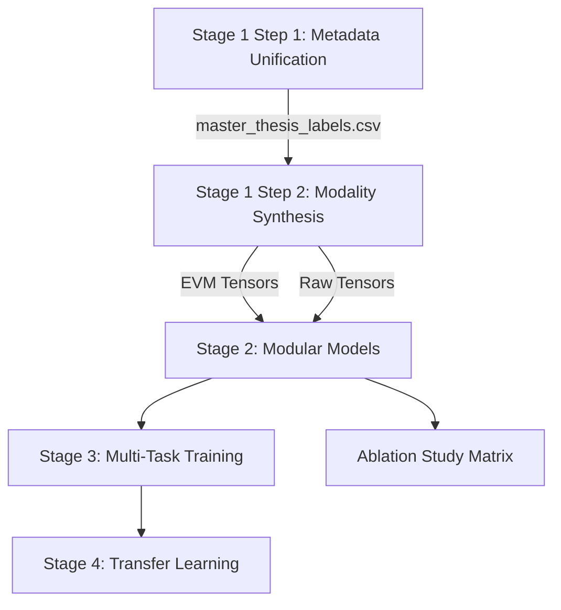

# Micro-Expression Recognition (MER) Thesis Workspace

This workspace contains the complete end-to-end pipeline and model architecture for my thesis on Micro-Expression Recognition. The project is split into discrete stages, progressing from raw metadata unification to dense optical flow/strain synthesis, modular model architecture design, multi-task adversarial training, transfer learning, and systematic ablation studies.

---

## Technical Stack & Requirements

A pre-configured virtual environment is located at `.\venv\`.
Key dependencies are listed in [requirements.txt](file:///c:/Users/Addhyan/Desktop/Thesis/Thesis3/requirements.txt):
* **Core Machine Learning:** PyTorch (v2.6.0 with CUDA 12.4 support), torchvision
* **Computer Vision & Math:** OpenCV (opencv-python), NumPy, SciPy
* **Data Handling:** pandas, openpyxl (for reading ground-truth Excel spreadsheets)
* **Visualization & Documentation:** matplotlib, tqdm

Ensure you activate the virtual environment or prefix commands with `.\venv\Scripts\python.exe`.

---

## Execution Sequence (How to Run Everything)

To process data, train models, and validate your findings, execute the stages in this order:



### Stage 1: Data Pipeline
#### Step 1: Metadata Unification
* **Why:** The raw ground-truth sheets from CASME II and CAS(ME)^2 have different structures, column naming schemes, frame rates (200 fps vs. 30 fps), and target emotion labels. This step parses, unifies, and builds a single standardized index.
* **How:**
  ```powershell
  .\venv\Scripts\python.exe Stage1_DataPipeline/main_step1.py
  ```
  *(Add `--force` if you need to clear checkpoints and re-generate the CSV from scratch.)*
* **Output:** `Processed_Data/master_thesis_labels.csv`

#### Step 2: Optical Flow & Strain Synthesis
* **Why:** facial micro-expressions are characterized by extremely subtle, sub-pixel muscle movements. This step extracts dense horizontal/vertical optical flow (u, v) and computes scalar optical strain (os) to capture deformation intensity. It normalizes each clip to exactly 32 frame pairs (32 time steps) for sequence models.
* **How (EVM Magnified Tensors):**
  Ensure your `Stage1_DataPipeline/config.py` is configured for EVM-magnified directories, then run:
  ```powershell
  .\venv\Scripts\python.exe Stage1_DataPipeline/main_step2.py
  ```
* **How (Raw unmagnified Tensors):**
  1. Change the output directory target in `Stage1_DataPipeline/step2_extraction/tensor_pipeline_manager.py` to `tensors_raw`.
  2. Change config roots in `config.py` to the raw unmagnified frames directories.
  3. Run `main_step2.py`.
* **Output:** `Processed_Data/tensors/` and `Processed_Data/tensors_raw/` containing `.npy` files of shape `(3, 32, 224, 224)`.

---

### Stage 2: Architecture (Modular Modeling)
* **Why:** Defines the baseline model components, including:
  1. **Three-Stream 3D-CNN:** Spatially analyzes flow and strain separately.
  2. **SimAM 3D Attention:** Computes parameter-free spatial attention over CNN feature maps.
  3. **SLSTT Transformer:** Encodes the temporal dynamics across the 32 timesteps.
* **Verification:** Run the standalone models script to ensure all configurations build and pass tensor geometry sanity checks:
  ```powershell
  .\venv\Scripts\python.exe Stage2_Architecture/models/hybrid_model.py
  ```

---

### Stage 3: Multi-Task Adversarial Training
* **Why:** Standard training can overfit to specific subject identities. This stage runs an adversarial training scheme using a Gradient Reversal Layer (GRL) to predict emotions while actively *penalizing* identity leakage, alongside Supervised Contrastive Loss (SupCon) and Cross-Batch Memory (XBM) to cluster similar emotions.
* **How:**
  ```powershell
  .\venv\Scripts\python.exe Stage3_Training/train.py
  ```

---

### Stage 4: Domain Adaptation & Transfer Learning
* **Why:** Evaluates cross-dataset generalization (e.g., training on CASME II and fine-tuning/evaluating on CAS(ME)^2).
* **How:**
  ```powershell
  .\venv\Scripts\python.exe Stage4_TransferLearning/transfer_train.py
  ```

---

### Ablation Study (Isolated Stage 1 + Stage 2 Matrix)
* **Why:** Scientifically isolates the contribution of each individual component (Eulerian Video Magnification, SimAM spatial attention, 3D-CNN features, and SLSTT Transformer) across an 8-cell matrix representing Phases I to IV of the thesis.
* **How (Smoke Test):** Run a fast, 1-epoch test on a limited number of samples:
  ```powershell
  .\venv\Scripts\python.exe Ablation_Study/run_ablation_experiments.py --epochs 1 --max_samples 16
  ```
* **How (Full Matrix Sweep):**
  ```powershell
  .\venv\Scripts\python.exe Ablation_Study/run_ablation_experiments.py
  ```
* **Outputs:** Checkpoints, JSON metrics, and confusion matrices saved under `Ablation_Study/results/` along with an aggregated summary in `Ablation_Study/results/summary.csv`.

---

## Directory Layout

* `Stage1_DataPipeline/` — Metadata unifiers, temporal interpolators, Farnebäck flow/strain synthesis.
* `Stage2_Architecture/` — Definitions for 3D-CNNs, SimAM, and SLSTT Transformer.
* `Stage3_Training/` — Main training loop including GRL, SupCon, and XBM queue.
* `Stage4_TransferLearning/` — Cross-domain adaptation and transfer weights loops.
* `Ablation_Study/` — Self-contained matrix runner driving configurations 1 through 8.
* `Processed_Data/` — Holds the generated master labels CSV and synthesized flow tensors.
* `DATASETS/` — Read-only original spreadsheets and raw frames directories.